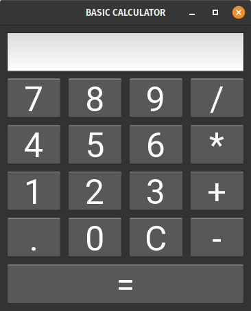

# Basic Calculator
Basic calculator built using Python 3 and Kivy.

## Motivation
I wanted to make a GUI project to build something visual in Python.

## Screenshots
The Basic Calculator opens in the below size: 

But it can also be resized. Unfortunately, the text is not resizable: 

The calculator works by clicking the desired buttons:

## Features
This calculator can 
- perform basic arithmetic calculations
- be built to run on any platform

## Contribute
Unfortunately I am not accepting contributions as this is a mini project which I do not intend to support or develop further.

## Credits
I created my app with help from the below tutorial by Mike Driscoll:

https://realpython.com/mobile-app-kivy-python/